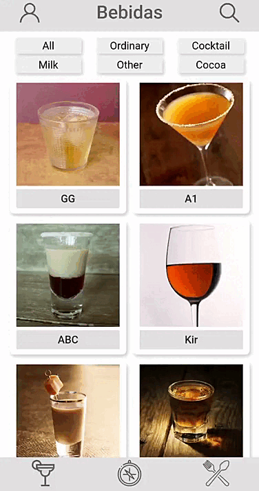

# FARM App de Receitas

## Contexto

O [FARM App de Receitas](https://farm-app-de-receitas.vercel.app/) é um site feito com React onde é possível ver, buscar, filtrar, favoritar e acompanhar o processo de preparação de comidas e drinks.
**O layout tem como foco dispositivos móveis.**

Este foi o projeto de conclusão do módulo de Front-End da Trybe.

Feito pela equipe:

- [@matheusg18](https://github.com/matheusg18)
- [@RobertRodriguesMartins](https://github.com/RobertRodriguesMartins)
- [@AlessandroFMello](https://github.com/AlessandroFMello)
- [@FernandoSegregio](https://github.com/FernandoSegregio)

## Tecnologias Usadas

Front-End:

> React, React Hooks, React ContextAPI, Bootstrap

Design:

> Figma

Organização da equipe:

> Trello, Kanban

## Executando a Aplicação

1. Instale as dependências

   ```js
   npm install
   ```

2. Inicie a aplicação React

   ```js
   npm start
   ```

## Exemplos de Funcionamento

[Link do projeto](https://farm-app-de-receitas.vercel.app/)

### Tela de login


### Tela de Comidas


### Tela de bebidas



### Tela de explorar


### Tela de perfil


